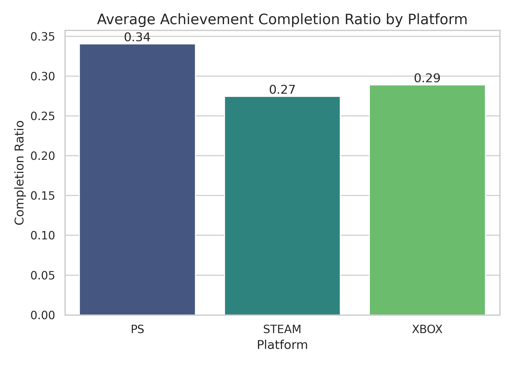
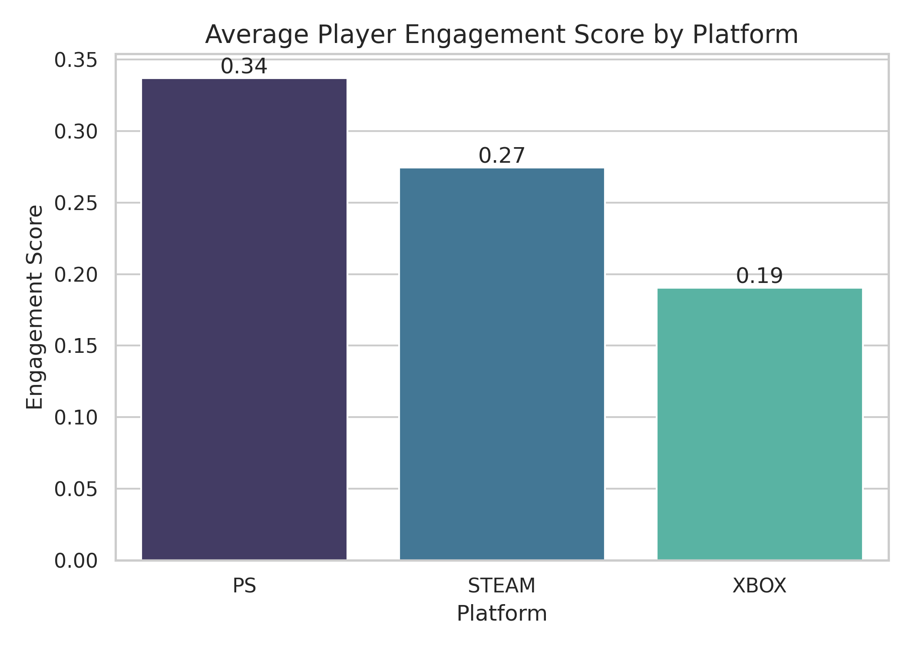
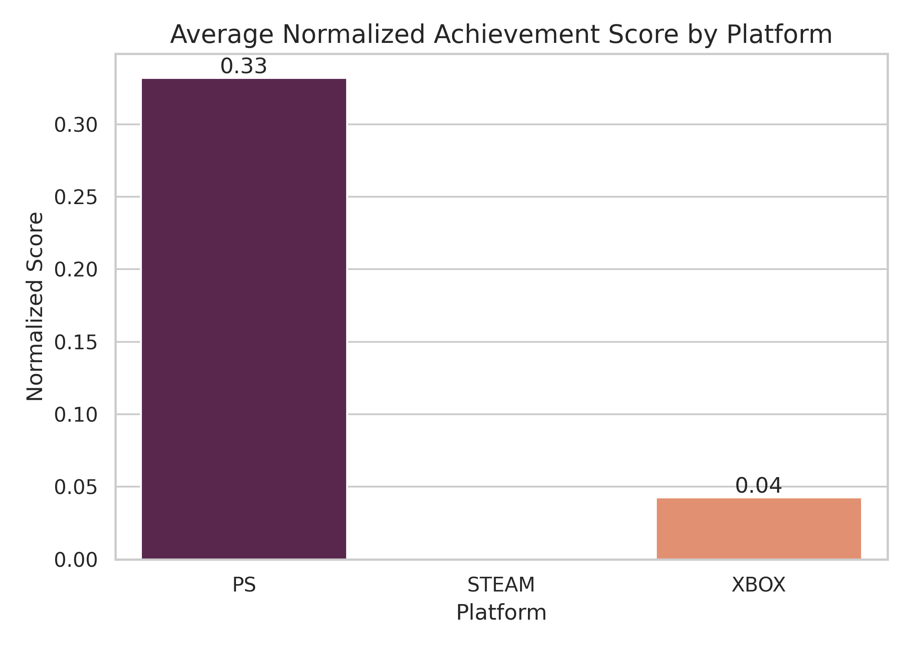
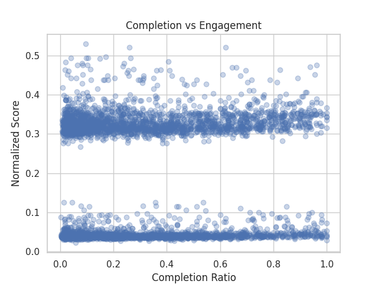

# Gaming Player Engagement Analysis

This project analyzes player engagement across Steam, PlayStation, and Xbox platforms using achievement completion and reward-system-based metrics.

The goal is to understand whether different reward systems influence player motivation to complete achievements.

---

# Research Question

Do reward systems (PlayStation rarity vs Xbox points) influence player engagement differently?

---

# Dataset

The analysis uses a processed dataset containing player achievement statistics across multiple gaming platforms.

Key variables:

- `completion_ratio` → percentage of achievements completed
- `normalized_score` → normalized reward score for achievements
- `engagement_score` → combined engagement metric

For Steam players, normalized scores are not available, so engagement is based on completion ratio.

---

# Methodology

Pipeline used in this project:

Raw Data → Bronze → Silver → Master → Gold → Python Analysis

Steps:

1. Raw achievement data was processed in BigQuery
2. Platform datasets were unified into a master engagement table
3. Gold-layer dataset exported to CSV
4. Python used for analysis and visualization

---

# Results

### Completion Ratio by Platform

### Engagement Score by Platform

### Normalized Score by Platform

### Completion Ratio vs Normalized Score

---
---

# Key Findings

- PlayStation shows the highest average engagement score among the platforms.
- Steam lacks normalized achievement scores, which limits direct comparison with console platforms.
- Completion ratio and normalized achievement score show a weak positive relationship.
- Regression results indicate that completion ratio alone explains only a small portion of engagement variation.
- Platform differences in player behavior appear statistically significant based on ANOVA testing.
# Repository Structure
gaming-player-engagement-analysis

charts/ → visualizations
data/ → dataset sample
notebooks/ → Jupyter analysis notebook
README.md → project documentation

---

# Tools Used

- Python
- Pandas
- Matplotlib
- Scikit-learn
- BigQuery
- Google Colab

---

# Author

Deniz Koroglu
